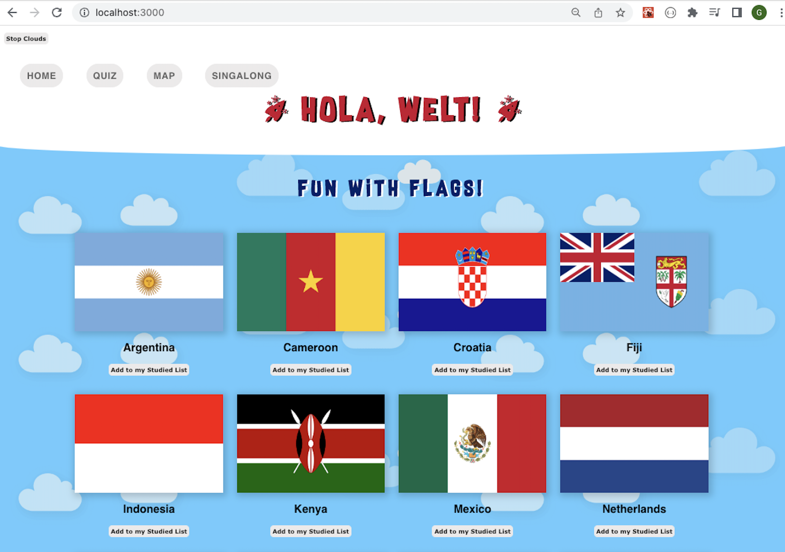

# Countries Educational React App



## Project Brief - Educational App

The BBC are looking to improve their online offering of educational content by developing some interactive browser applications that display information in a fun and interesting way. Your task is to make an a Minimum Viable Product or prototype to put forward to them - this may only be for a small set of information, and may only showcase some of the features to be included in the final app.


A user should be able to:

- view some educational content on a particular topic
- be able to interact with the page to move through different sections of content
- Use an API to bring in content or a database to store information.
- Use charts or maps to display your information to the page.

## Technologies 

- HTML/CSS<br>
- Javascript<br>
- React<br>
- Mongo DB<br>

---

## Run in Docker - build locally

_Ensure you have [Docker installed](https://docs.docker.com/get-docker/) and running on your machine._

Run the containers:

```
docker-compose up -d
```

Seed the database:

```
docker exec mongod bash -c "mongo < seed_data.js"  
```

App should be running on [localhost:3000](http://localhost:3000)

Stop the containers:

```
docker-compose down
```

---


## Alternative manual steps to run

This project was bootstrapped with Create React App.<br>

_Ensure you have Node.js installed https://nodejs.org/en/ on your machine_<br>

- Install Node Package Manager(NPM):<br>
<br>Run:
```
npm update

npm install 
```


## Run the Server - open "Server" folder in terminal 

- To use NPM in Server application:<br>
<br>Run:
```
npm init -y
```


 - Create a web server with JavaScript library **Express**:<br>
 <br>Run:
 ```
npm install express
```


- (Optional)To install nodeman via npm and used via npm scripts.
(A utility that used to watch for modifications and restart the application if the server.js file changes):<br>
<br>Run:
```
npm install --save-dev nodemon
```


- Run server:<br>
<br>Run:
```
npm run server:dev
```


- Install **MongoDB**: <br>
<br>Run:
``` 
npm i mongodb@3.5.7
```


- Seed the database:<br>
<br>Run:
```
npm run seeds
```


*(leave terminal window running)*


## Run the Frontend - open "Client" folder in second terminal 


- Run server (runs the app in the development mode):<br>
<br>Run:
```
npm run start 
```

*(leave terminal window running)*

App should be running on [localhost:3000](http://localhost:3000)


